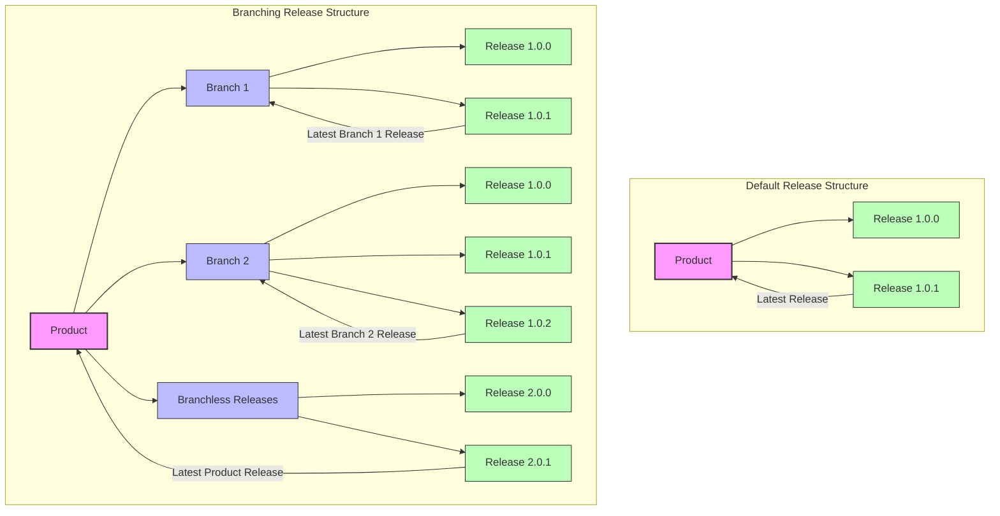

## Product Configuration

When implementing Lukittu in your application, you should specify which Lukittu product the software represents. While optional, this is recommended for:

-   Better tracking capabilities
-   Improved access management
-   Enhanced usage analytics

Product identification is done using a UUID v4 product ID in your implementation.

## Release Management

### Overview

Products can maintain multiple releases to track different software versions. This feature provides:

-   Version tracking across your user base
-   Integration with remote classloader functionality
-   Historical version management

### Release States

#### 1. Published

The standard state for active releases:

-   Available to all licenses with product access
-   Can be tagged as "latest" for fallback versioning
-   Represents production-ready software

#### 2. Draft

Preparation state for upcoming releases:

-   Created but not yet publicly available
-   Allows preparation of release materials
-   Can be published when ready for deployment

#### 3. Archived

Historical state for inactive releases:

-   No longer available for use
-   Maintained for record-keeping
-   Useful for audit and tracking purposes

#### 4. Deprecated

Warning state for sunset releases:

-   Remains functional and accessible
-   Includes deprecation notifications
-   Encourages users to upgrade
-   Helps manage version transitions

### Latest Release Tag

Published releases can receive the "latest" designation:

-   Only one release can be "latest" at a time
-   Serves as the default version for unspecified requests
-   Simplifies version management

### Release Branching

Lukittu supports release branching to manage multiple release streams for a single product. This feature is particularly useful when:

-   Your product has different artifacts for different platforms
-   You maintain separate release cycles for various environments
-   You need to distribute platform-specific versions

#### How Branching Works

Without branches (default behavior):

-   A product has a single linear release timeline
-   Only one release can be designated as "latest"
-   Versioning follows a standard progression (e.g., 1.0.0 → 1.0.1)

With branches:

-   Each branch maintains its own release timeline
-   Every branch can have its own "latest" release
-   Versioning is branch-specific
-   Verify requests can target a specific branch's latest or a specific version

#### Branch Use Case

This is especially useful for classloader users who distribute Java JAR files to different platforms. Each platform can have its own branch with platform-specific releases while maintaining consistent versioning schemes.

#### When to Use Branching

Consider using release branching when:

-   You need to maintain separate builds for different platforms
-   Your application has different feature sets across deployment targets

<Tip>
    When implementing verification logic, remember to specify the branch name
    when targeting branch-specific releases.
</Tip>

### Release Restrictions

Control release accessibility through license-specific restrictions:

-   Enable controlled beta testing
-   Manage gradual version rollouts
-   Test with select users before wide release
-   Create exclusive access for specific licenses

## Best Practices

### Version Naming

<Tip>
    We recommend following [semver](https://semver.org/) (Semantic Versioning)
    conventions.
</Tip>

Semantic versioning:

-   Provides clear version hierarchy
-   Communicates change significance
-   Maintains industry-standard versioning
-   Helps users understand update importance
