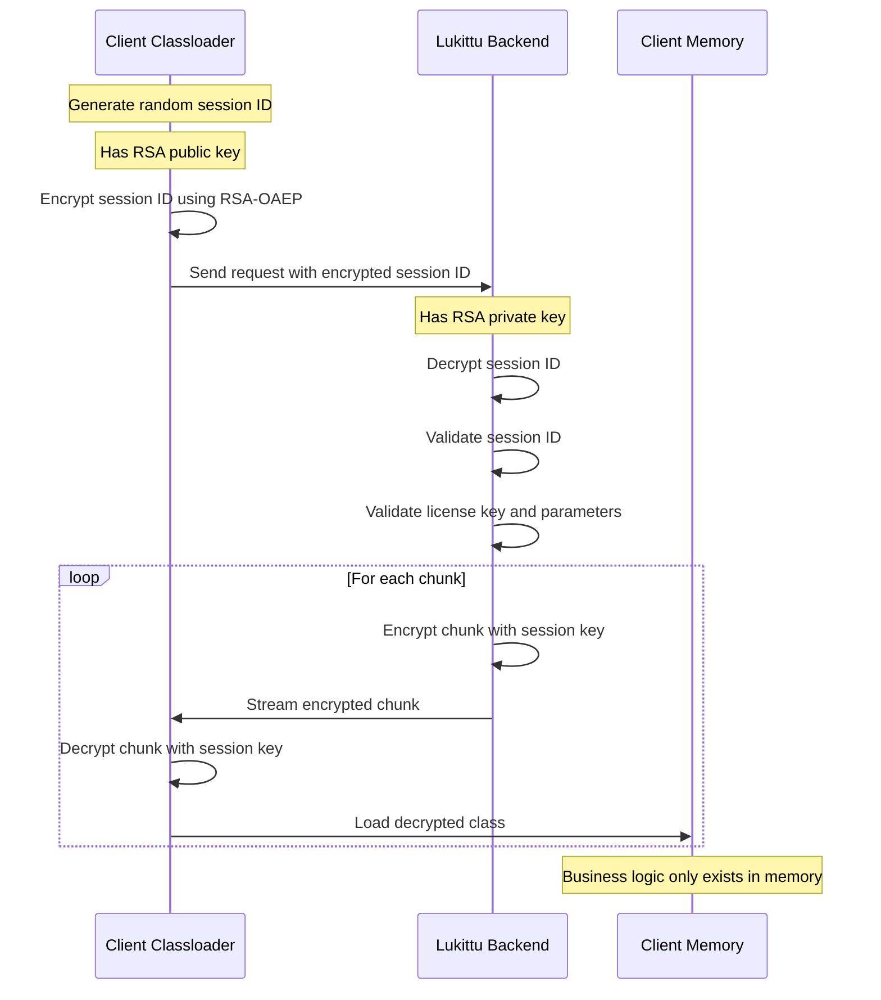

```mermaid
sequenceDiagram
    participant Client as Client Classloader
    participant Backend as Lukittu Backend
    participant Memory as Client Memory

    Note over Client: Generate random session ID
    Note over Client: Has RSA public key
    
    Client->>Client: Encrypt session ID using RSA-OAEP
    
    Client->>Backend: Send request with encrypted session ID
    
    Note over Backend: Has RSA private key
    Backend->>Backend: Decrypt session ID
    Backend->>Backend: Validate session ID
    Backend->>Backend: Validate license key and parameters
    
    loop For each chunk
        Backend->>Backend: Encrypt chunk with session key
        Backend->>Client: Stream encrypted chunk
        Client->>Client: Decrypt chunk with session key
        Client->>Memory: Load decrypted class
    end
    
    Note over Memory: Business logic only exists in memory
```