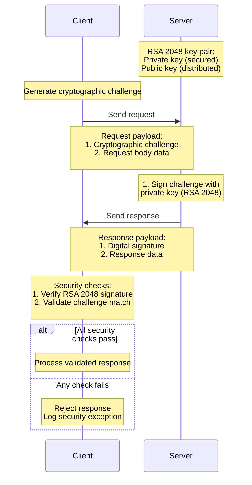
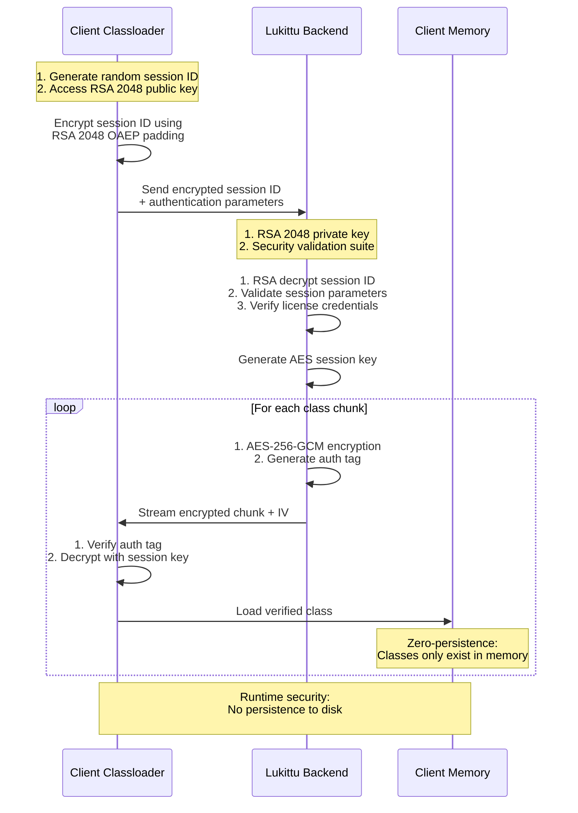

## Introduction

Lukittu client-server communication employs a sophisticated hybrid cryptographic system that combines both asymmetric (RSA 2048) and symmetric encryption to ensure maximum security and integrity. This documentation provides a detailed overview of the communication processes.

## HTTP Communication Security

The general HTTP communication between client and server implements asymmetric cryptography with the following characteristics:

- Server maintains an RSA 2048 key pair:
  - Private key (secured on server)
  - Public key (distributed to clients)
- Clients possess only the server's public key
- Challenge-response verification ensures request authenticity
- All transmitted data is cryptographically signed

### HTTP Communication Flow

## Classloader Security Architecture

The Classloader implements an advanced encryption scheme that protects both data in transit and ensures secure class loading:

- Uses RSA 2048 for key exchange
- Implements AES-256-GCM for chunk encryption
- Maintains zero-persistence security model
- Employs session-based encryption with rotating keys

### Classloader Communication Flow

